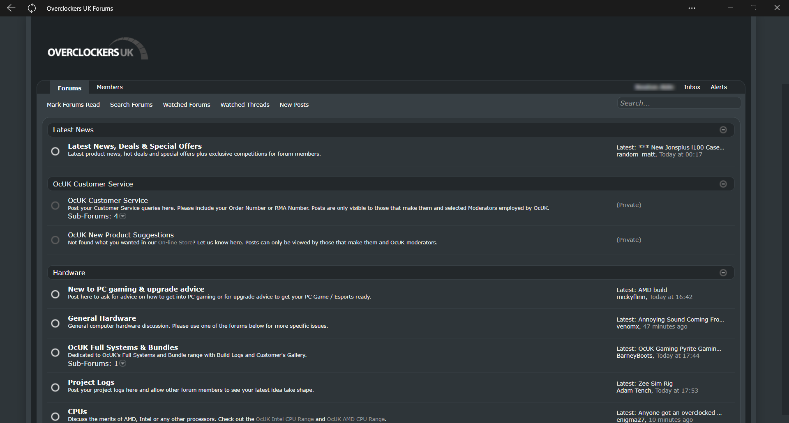

<h1 align="center">
	Xen Complete Mod OcUK Theme
</h1>

	
	
	

<h3 align="center">
	 Designed by Wiiija
</h3>

	<strong>
		<a href="https://www.overclockers.co.uk/forums/">Forum Website</a>
		•
		<a href="https://www.overclockers.co.uk/forums/threads/the-ocuk-new-stylish-themes-thread-2017.18769736/">Thread Discussion</a>
	</strong>

	

## Description :sparkles:
A Xen Complete Mod theme for the new forum at OcUK. Now complete and polished!

If you use and like feel free to buy me a coffee, paypal: rail.monkey@ntlworld.com

<b>Author</b> - Sean Mayes 
<b>Date Created</b> - March 07, 2021 
<b>Applies To</b> - overclockers

## Notes :sparkles:
To use these themes you will need the Stylus/Stylish browser extension for your chosen browser or forks of listed browsers (vivaldi, palemoon etc):

<a href="https://addons.mozilla.org/en-GB/firefox/addon/styl-us/">Firefox</a>
•
<a href="https://chrome.google.com/webstore/detail/stylus/clngdbkpkpeebahjckkjfobafhncgmne?hl=en">Chromium</a>
•
<a href="https://addons.opera.com/en-gb/extensions/details/stylus/">Opera</a>
•
<a href="http://sobolev.us/stylish/">Safari</a>

## Installation :sparkles:
> 01. Once you have the Stylus browser extention installed instructions above.  
> 02. click the "Install directly with Stylus" icon at the top of this page.  
> 03. Enable it in the Stylus/Stylish extension if it isn't already.  
> 04. Load the ocuk forum and the layout should have changed.

## Issues :sparkles:  
If you have an issue, change request or comments about this theme please report it below: 
<a href="https://github.com/el-profesor926/OcUK-Theme-Xen-Complete-Mod/issues">/OcUK-Theme-Xen-Complete-Mod/issues</a>
